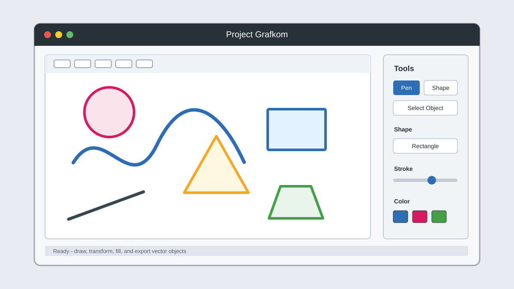

# Vector-Paint-Studio

Vector-Paint-Studio is a Python and PySide6 desktop application for drawing simple vector objects.



## Fedora Installation

Run this from the `projectGrafkom` directory:

```bash
chmod +x install.sh
./install.sh
```

The installer will:

- copy the application to `~/.local/share/projectgrafkom`
- create a dedicated Python virtual environment
- install dependencies from `requierement.txt`
- create the terminal command `projectgrafkom`
- create a Fedora desktop application shortcut

The Python dependency installation requires an internet connection if PySide6, numpy, and matplotlib are not already available in the `pip` cache.
The installer may also ask for your `sudo` password to install Fedora system packages such as `python3`, `python3-pip`, or `python3-virtualenv` if they are missing.

## Running the Application

After installation, run:

```bash
projectgrafkom
```

You can also open the Fedora application menu and search for **Project Grafkom**.

If the `projectgrafkom` command is not available in your current terminal session, close the terminal and open it again. Also make sure `~/.local/bin` is included in your `PATH`.

## Running Without Desktop Installation

To run directly from the source directory:

```bash
python3 -m venv .venv
source .venv/bin/activate
pip install -r requierement.txt
python ProjectGrafkom.py
```

## Uninstall

Run:

```bash
./install.sh uninstall
```

This removes the user-local installation files:

- `~/.local/share/projectgrafkom`
- `~/.local/bin/projectgrafkom`
- `~/.local/share/applications/projectgrafkom.desktop`
- `~/.local/share/icons/hicolor/scalable/apps/projectgrafkom.svg`

## Dependencies

Python dependencies:

- PySide6
- numpy
- matplotlib

## License

This project is licensed under the MIT License. See [LICENSE](LICENSE) for details.
